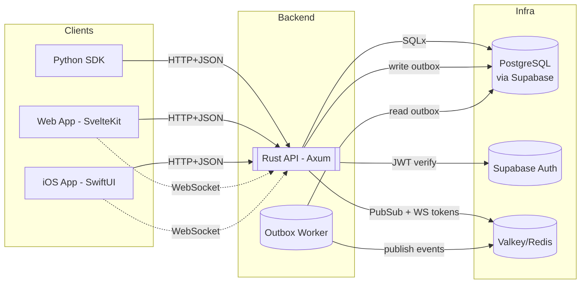

# Tora: ML Experiment Management Tool

A lightweight ML experiment tracking platform designed for speed and simplicity

## Architecture Overview

Tora consists of the following components and data flows:

